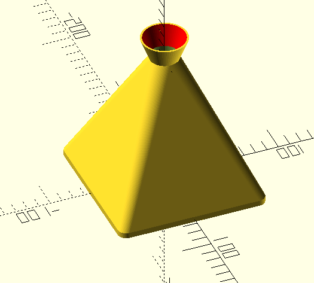
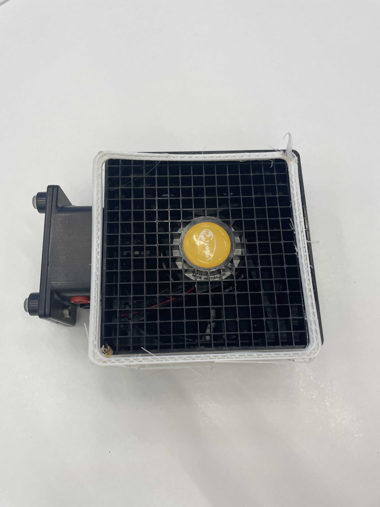

# Работа Емельянова Михаила
# Проект «Pong Levitation» на языке OpenScad

Модель для 3D печати сопла с чехлом для вентилятора из эксперементального набора альтернативных источников энергии leXsolar, которая используется для проведения физического опыта по левитации шарика от пинг-понга, настольного тенниса, в потоке воздуха. Ускорение потока воздуха выполняется с помощью сопла Лаваля. 

### Фотография рамки с вентилятором
[Комплект для эксперимента](https://lexsolar.com/shop-en/product-information/1406_en) на официальном сайте leXsolar - Wind Professional.

Фотография распечатанной тестовой модели:
 
